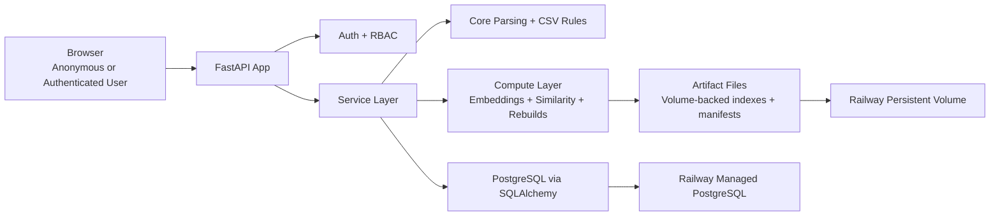

# Architecture

## Overview

The system is a single-web-service application deployed on Railway. One Railway web service hosts the FastAPI backend, serves the built React frontend, runs an in-process background job runner, and uses a mounted volume for local artifacts. PostgreSQL is the transactional source of truth.

The architecture favors:
- strict CSV compatibility;
- a single active dataset at a time;
- built-in authentication with role-based access control;
- public anonymous exploration with a minimal public API surface;
- durable full rebuild jobs;
- optimistic concurrency for shared editing;
- durable audit and review workflows;
- clear separation between parsing, storage, services, compute, and API layers.



## Deployment Topology

### Railway Shape

- One Railway web service for the FastAPI app, built frontend, and in-process background runner.
- One Railway-managed PostgreSQL service.
- One persistent volume mounted into the web service.
- One runtime process group that includes:
  - FastAPI HTTP server;
  - frontend static asset serving;
  - background job runner loop.

### Why A Single Web Replica

- Search artifacts are local files on the attached volume.
- The initial product accepts full rebuild cost, so a separate worker service is unnecessary complexity.
- The job runner lives inside the web process.
- Running multiple replicas would require stronger coordination for job claiming and shared local artifact management.

## Layer Boundaries

The backend follows the repository boundary requirements:

- `core`
  - pure parsing, normalization, CSV schema, coordinate parsing;
  - no database access;
  - no web framework concerns.
- `db`
  - SQLAlchemy models, sessions, and Alembic migrations;
  - persistence mappings only.
- `services`
  - business operations, transactions, optimistic concurrency checks;
  - orchestration of auth, imports, story edits, trope and keyword curation, reviews, exports, and audit writes.
- `compute`
  - embeddings, similarity, rebuild execution, and local artifact management;
  - depends on service interfaces, not route handlers.
- `api`
  - FastAPI routes, dependencies, and Pydantic schemas only;
  - converts HTTP input/output to service calls;
  - owns authentication dependencies and role enforcement.
- `frontend`
  - React UI only;
  - handles session-aware navigation and role-aware presentation;
  - does not contain domain logic beyond presentation concerns and client-side form state.

## Runtime Model

### Shared Global State

- The product has one active dataset visible to all users.
- All authenticated browsers work against the same shared dataset.
- There is no per-user workspace or draft namespace in the initial product.
- Anonymous users have access only to the public exploration workflow.

### Active Dataset Strategy

- Each full CSV import creates a staged dataset revision in PostgreSQL.
- Validation and full rebuild happen against the staged revision.
- The active dataset pointer changes only after a successful staged rebuild.
- Older dataset revisions may remain in storage for safety and traceability, but they are not active in the UI.

### Routine Edit Strategy

- Story create and edit operations update the active dataset immediately in PostgreSQL.
- Canonical trope and keyword creation also writes immediately to PostgreSQL.
- After a successful write, the system enqueues a full rebuild job for derived artifacts.
- Structured story and term data is therefore strongly consistent in PostgreSQL.
- Similarity artifacts and exploration views are eventually consistent until the rebuild job succeeds.

### Review Visibility Strategy

- Contributor-created and contributor-edited content is visible immediately.
- The normal UI does not show a pending-review marker.
- Review state exists as admin-only metadata and is surfaced through dedicated admin workflows.

## Security Model

### Authentication

- Authentication is built-in email/password.
- Accounts are admin-created or invite-only.
- There is no self-signup.
- Password reset is admin-triggered.

### Sessions

- The product uses server-managed sessions rather than a public bearer-token model.
- Session state is stored durably in PostgreSQL.
- Sessions must be revocable.
- User deactivation must invalidate active sessions.

### Authorization

- Access control is role-based:
  - `anonymous` for public exploration only;
  - `guest` for authenticated read-only access;
  - `contributor` for write access to stories and new canonical terms;
  - `admin` for dataset management, user management, curation, and review resolution.
- Authorization is enforced in API dependencies and service-layer checks.

## Data Model

This is the target high-level relational model.

### `users`

Stores application users.

Suggested fields:
- `id`
- `email`
- `display_name`
- `role`
- `password_hash`
- `status` such as `active`, `inactive`, `pending_invite`
- `created_at`
- `updated_at`
- `last_login_at`
- `deactivated_at`

### `user_sessions`

Stores revocable authenticated sessions.

Suggested fields:
- `id`
- `user_id`
- `session_token_hash`
- `csrf_token_hash`
- `created_at`
- `expires_at`
- `revoked_at`
- `last_seen_at`
- `ip_address`
- `user_agent`

### `invite_reset_tokens`

Stores one-time admin-created invite and password-reset tokens.

Suggested fields:
- `id`
- `user_id`
- `token_hash`
- `token_kind` such as `invite` or `admin_reset`
- `created_by_user_id`
- `created_at`
- `expires_at`
- `consumed_at`

### `datasets`

Stores dataset revisions and the active-dataset concept.

Suggested fields:
- `id`
- `status` such as `staged`, `active`, `archived`, `failed`
- `version`
- `source_filename`
- `created_by_user_id`
- `created_at`
- `activated_at`
- `story_count`
- `trope_count`
- `keyword_count`
- `notes_json`

### `stories`

Stores one story row inside a dataset revision.

Suggested fields:
- `id`
- `dataset_id`
- `version`
- `record_origin` such as `csv_import` or `manual`
- `source_row_number`
- `label`
- `fields_json`
- `search_text`
- `space_coord_raw`
- `created_by_user_id`
- `updated_by_user_id`
- `created_at`
- `updated_at`

Rationale:
- `fields_json` preserves the legacy CSV-compatible field map without forcing every legacy field into dedicated application columns.
- selected derived columns such as `label` and `space_coord_raw` support browsing and exploration efficiently.

### `tropes`

Stores canonical trope strings for a dataset.

Suggested fields:
- `id`
- `dataset_id`
- `version`
- `text`
- `normalized_text`
- `review_status`
- `created_by_user_id`
- `updated_by_user_id`
- `story_count`
- `created_at`
- `updated_at`

Constraints:
- unique on `(dataset_id, normalized_text)`.

### `story_tropes`

Join table between stories and tropes.

Suggested fields:
- `story_id`
- `trope_id`
- `position`
- `origin`
- `status`
- `created_by_user_id`
- `updated_by_user_id`
- `created_at`
- `updated_at`

Notes:
- `position` preserves user-entered order for stable round-trip serialization.
- deleting a row here is the hard delete of a trope assignment.

### `keywords`

Stores canonical keyword strings for a dataset.

Suggested fields:
- `id`
- `dataset_id`
- `version`
- `text`
- `normalized_text`
- `review_status`
- `created_by_user_id`
- `updated_by_user_id`
- `story_count`
- `created_at`
- `updated_at`

Constraints:
- unique on `(dataset_id, normalized_text)`.

### `story_keywords`

Join table between stories and keywords.

Suggested fields:
- `story_id`
- `keyword_id`
- `position`
- `created_by_user_id`
- `updated_by_user_id`
- `created_at`
- `updated_at`

### `review_items`

Stores admin review work generated by contributor actions.

Suggested fields:
- `id`
- `dataset_id`
- `review_type` such as `story_created`, `story_updated`, `trope_pending`, `keyword_pending`
- `subject_table`
- `subject_id`
- `status` such as `pending`, `approved`, `rejected`, `resolved`
- `created_by_user_id`
- `resolved_by_user_id`
- `created_at`
- `resolved_at`
- `metadata_json`

### `audit_events`

Stores durable audit records.

Suggested fields:
- `id`
- `event_type`
- `actor_user_id`
- `dataset_id`
- `subject_table`
- `subject_id`
- `request_id`
- `created_at`
- `payload_json`

### `jobs`

Durable background job records.

Suggested fields:
- `id`
- `dataset_id`
- `job_type` such as `import_dataset` or `full_rebuild`
- `status` such as `queued`, `running`, `succeeded`, `failed`, `cancelled`
- `requested_by_user_id`
- `requested_at`
- `started_at`
- `finished_at`
- `error_code`
- `error_message`
- `payload_json`
- `result_json`

### `term_embeddings`

Stores term embeddings in PostgreSQL-backed metadata with vectors persisted in database records as the current implementation does.

Suggested fields:
- `id`
- `dataset_id`
- `term_kind`
- `trope_id` or `keyword_id`
- `model_name`
- `artifact_version`
- `vector_dimensions`
- `vector_blob`
- `content_hash`
- `created_at`

### `term_similarity_cache`

Stores pairwise similarity metadata for current artifact versions.

Suggested fields:
- `id`
- `dataset_id`
- `term_kind`
- `model_name`
- `artifact_version`
- `source_term_id`
- `target_term_id`
- `similarity_score`
- `metadata_json`
- `created_at`

## Persistent Volume Layout

Suggested layout on the Railway volume:

```text
/storage/
  model-cache/
  uploads/
  exports/
  artifacts/
    active/
      tropes.index
      keywords.index
      manifest.json
    staged/
```

Notes:
- PostgreSQL is the system of record, so the database itself does not live on the volume.
- `active/` is used by the currently visible dataset.
- staged imports and rebuilds can write into a separate temporary directory before atomic promotion.
- exported CSV files do not need to be permanently retained, but the volume makes short-lived retention possible if useful.

## Background Job Architecture

### Job Types

- `import_dataset`
  - validate uploaded CSV;
  - parse stories, tropes, and keywords;
  - persist a staged dataset revision in PostgreSQL;
  - run a full rebuild;
  - promote staged dataset to active on success.
- `full_rebuild`
  - rebuild trope and keyword lexical indexes;
  - rebuild trope and keyword semantic indexes;
  - write a manifest to the volume;
  - mark the latest artifact revision as current.

### Job Runner

- The FastAPI process runs an internal job runner loop on startup.
- The runner polls PostgreSQL for queued jobs.
- Job claiming should use PostgreSQL-safe locking semantics so only one runner instance claims a job.
- Failed jobs remain visible in PostgreSQL with structured error fields.

## API And Service Responsibilities

### API Responsibilities

- Authenticate requests and resolve the current user when required.
- Enforce route-level access control.
- Validate request payloads.
- Return stable error shapes for auth, conflict, validation, and not-found cases.

### Service Responsibilities

- Enforce business rules even if API protections are bypassed.
- Apply optimistic concurrency checks.
- Write audit events for important actions.
- Create review items for contributor-generated changes.
- Queue rebuild jobs after qualifying mutations.

## Railway Operational Notes

- Use one Railway web service, one Railway-managed PostgreSQL service, and one volume.
- Keep the web service at a single replica.
- Run Alembic migrations during deployment startup.
- Configure the app to trust Railway proxy headers so secure cookie behavior is correct behind HTTPS.
