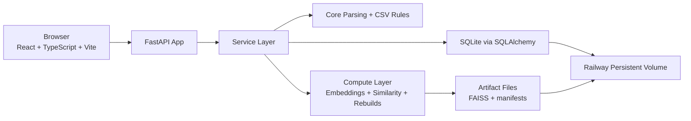

# Architecture

## Overview

The system is a single-service web application deployed on Railway. One service hosts the FastAPI backend, serves the built React frontend, runs an in-process background job runner, and stores all durable state on a persistent volume.

The architecture favors:
- strict CSV compatibility;
- a single active dataset at a time;
- durable full rebuild jobs;
- optimistic concurrency for shared editing;
- clear separation between parsing, storage, services, compute, and API layers.



## Deployment Topology

### Railway Shape

- One Railway service.
- One persistent volume mounted into that service.
- One runtime process group that includes:
  - FastAPI HTTP server;
  - frontend static asset serving;
  - background job runner loop.

### Why A Single Service

- SQLite is the system of record and lives on the persistent volume.
- Search artifacts are local files on the same volume.
- The initial product accepts full rebuild cost, so a separate worker service is unnecessary complexity.
- The deployment should run as a single replica to avoid multiple app instances competing for local SQLite and file-based artifacts.

## Layer Boundaries

The backend follows the repository boundary requirements:

- `core`
  - pure parsing, normalization, CSV schema, coordinate parsing;
  - no database access;
  - no web framework concerns.
- `db`
  - SQLAlchemy models, sessions, migrations;
  - persistence mappings only.
- `services`
  - business operations, transactions, optimistic concurrency checks;
  - orchestration of imports, story edits, trope curation, and exports.
- `compute`
  - embeddings, FAISS management, similarity search, rebuild execution;
  - depends on service interfaces, not route handlers.
- `api`
  - FastAPI routes and Pydantic schemas only;
  - converts HTTP input/output to service calls.
- `frontend`
  - React UI only;
  - no domain logic beyond presentation concerns and client-side form state.

## High-Level Runtime Model

### Shared Global State

- The product has one active dataset visible to all users.
- All browsers work against the same shared dataset.
- There is no per-user workspace or draft namespace in the initial product.

### Active Dataset Strategy

- Each full CSV import creates a staged dataset revision.
- Validation and full rebuild happen against the staged revision.
- The active dataset pointer changes only after a successful staged rebuild.
- Older dataset revisions may remain in storage for safety and traceability, but they are not active in the UI.

### Routine Edit Strategy

- Story create/edit and trope curation operations update the active dataset immediately in SQLite.
- After a successful write, the system enqueues a full rebuild job for derived artifacts.
- Structured story data is therefore strongly consistent in SQLite.
- Similarity artifacts and exploration views are eventually consistent until the rebuild job succeeds.

## Data Model

This is the recommended initial relational model.

### `datasets`

Stores dataset revisions and the active-dataset concept.

Suggested fields:
- `id`
- `status` such as `staged`, `active`, `archived`, `failed`
- `version`
- `source_filename`
- `created_at`
- `activated_at`
- `story_count`
- `trope_count`
- `keyword_count`
- `notes_json`

### `stories`

Stores one story row inside a dataset revision.

Suggested fields:
- `id`
- `dataset_id`
- `version`
- `record_origin` such as `csv_import` or `manual`
- `source_row_number`
- `label`
- `fields_json`
- `search_text`
- `space_coord_raw`
- `created_at`
- `updated_at`

Rationale:
- `fields_json` preserves the legacy CSV-compatible field map without forcing 39 dedicated columns into application code everywhere.
- derived columns such as `label` and `space_coord_raw` help browsing and exploration.

### `tropes`

Stores canonical trope strings for a dataset.

Suggested fields:
- `id`
- `dataset_id`
- `version`
- `text`
- `normalized_text`
- `story_count`
- `created_at`
- `updated_at`

Constraints:
- unique on `(dataset_id, normalized_text)`.

### `story_tropes`

Join table between stories and tropes.

Suggested fields:
- `story_id`
- `trope_id`
- `position`

Notes:
- `position` preserves user-entered order for stable round-trip serialization.
- deleting a row here is the hard delete of a trope assignment.

### `keywords`

Stores canonical keyword strings for a dataset.

Suggested fields:
- `id`
- `dataset_id`
- `version`
- `text`
- `normalized_text`
- `story_count`
- `created_at`
- `updated_at`

Constraints:
- unique on `(dataset_id, normalized_text)`.

### `story_keywords`

Join table between stories and keywords.

Suggested fields:
- `story_id`
- `keyword_id`
- `position`

### `jobs`

Durable background job records.

Suggested fields:
- `id`
- `dataset_id`
- `job_type` such as `import_dataset` or `full_rebuild`
- `status` such as `queued`, `running`, `succeeded`, `failed`, `cancelled`
- `requested_by`
- `requested_at`
- `started_at`
- `finished_at`
- `error_code`
- `error_message`
- `payload_json`
- `result_json`

### `artifact_revisions`

Tracks the last successful derived search artifacts for a dataset.

Suggested fields:
- `id`
- `dataset_id`
- `status`
- `model_name`
- `manifest_json`
- `created_at`

## Persistent Volume Layout

Suggested layout on the Railway volume:

```text
/storage/
  app.db
  uploads/
  exports/
  artifacts/
    active/
      tropes.faiss
      keywords.faiss
      tropes_index.json
      keywords_index.json
      manifest.json
    staged/
```

Notes:
- `active/` is used by the currently visible dataset.
- staged imports and rebuilds can write into a separate temporary directory before atomic promotion.
- exported CSV files do not need to be permanently retained, but the volume makes short-lived retention possible if useful.

## Background Job Architecture

### Job Types

- `import_dataset`
  - validate uploaded CSV;
  - parse stories, tropes, and keywords;
  - persist a staged dataset revision;
  - run a full rebuild;
  - promote staged dataset to active on success.
- `full_rebuild`
  - rebuild trope and keyword lexical indexes;
  - rebuild trope and keyword FAISS indexes;
  - write a manifest;
  - mark the latest artifact revision as current.

### Job Runner

- The FastAPI process runs an internal job runner loop on startup.
- The runner polls SQLite for queued jobs.
- The runner claims one job at a time using transactional status changes.
- Rebuild jobs should be coalesced when possible so multiple quick edits do not create redundant back-to-back rebuild work.

### Failure Handling

- Failed jobs remain visible in SQLite with structured error fields.
- Failed routine rebuilds do not roll back already committed story edits.
- Failed staged imports do not replace the active dataset.

## Similarity Architecture

### Scope

- Similarity search is supported only for tropes and keywords.
- There is no semantic search over whole stories in the initial product.

### Model

- Embedding model: `sentence-transformers/paraphrase-multilingual-mpnet-base-v2`.

### Artifact Strategy

- The compute layer builds one lexical index and one FAISS index for tropes.
- The compute layer builds one lexical index and one FAISS index for keywords.
- Artifacts are file-based and loaded from the persistent volume.
- The active manifest records the artifact revision and model metadata used by the running dataset.

### Service Boundary

- The API and services should talk to a similarity service interface rather than directly to FAISS or sentence-transformers.
- This keeps vector search replaceable and testable.

## Optimistic Concurrency

### Required Versioned Resources

- dataset
- story
- trope

### Write Behavior

- Every write includes an `expected_version`.
- The service layer compares the expected version with the current row version inside the write transaction.
- On mismatch, the service returns a conflict error with the latest server version and current resource snapshot.

### SQLite Strategy

- Use WAL mode for better concurrent read/write behavior.
- Keep write transactions short and scoped to service operations.
- Avoid long-running work inside database transactions; rebuild computation runs outside the main write transaction and is tracked by jobs.

## Import And Export Flows

### Import

1. API accepts multipart CSV upload plus the expected dataset version.
2. Service records an `import_dataset` job.
3. Job validates and parses the CSV according to the legacy contract.
4. Job persists a staged dataset revision.
5. Job runs the full rebuild.
6. On success, the staged dataset becomes active atomically.

### Export

1. API reads the active dataset from SQLite.
2. Service serializes rows using the canonical legacy column order.
3. Response streams a UTF-8 BOM CSV file.

## Frontend Architecture

### Application Responsibilities

- Fetch active dataset status and job status.
- Render story list, story detail, story edit forms, import/export controls, and exploration views.
- Send versioned mutation requests.
- Surface optimistic concurrency conflicts and rebuild status clearly.

### Client State

- Query and mutation state should live in frontend data-fetching hooks.
- The frontend should not store domain rules about parsing or CSV serialization.
- The frontend may store local unsaved form state and UI filter state only.

## Design Implications

- The product should not copy the legacy Streamlit page structure or session-state mechanics.
- The rewrite should preserve legacy parsing and CSV semantics while moving all business logic out of the UI layer.
- Because full rebuilds are acceptable, the first implementation should prefer simple, correct full recomputation over fragile incremental artifact updates.
